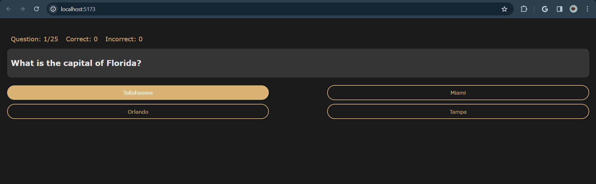
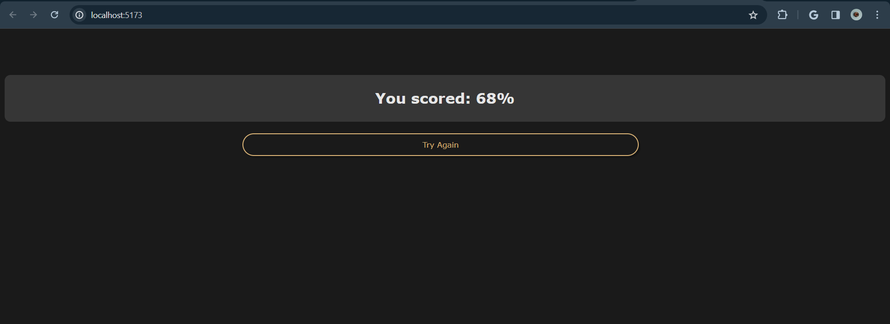

  
    <h1>React Trivia Game</h1>

### Visual IDE
This project was bootstrapped with [`Codux`](https://www.codux.com/) and [`Vite`](https://vitejs.dev).

- Edited, rendered, and composed an app that makes use of **`React`**-based components.
- Created components with **`TypeScript`**, **`SCSS`** and **`CSS Modules`** support.
- Visually edited in real-time and in an isolated environment.

### Available Scripts

In the project directory, you can run:

### `npm run build`

### `npm run dev`

### `npm run preview`

## Implementation
### Quiz GUI Screen

### Button Hover State

### Next Button

### End Screen

